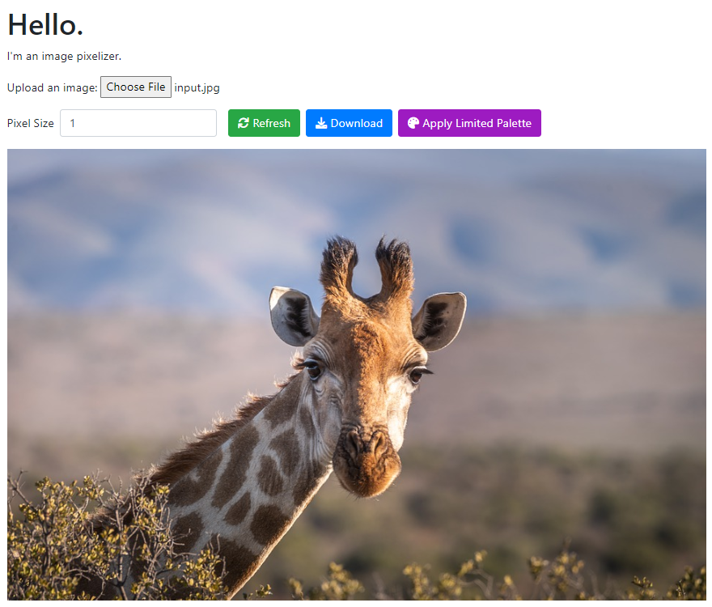
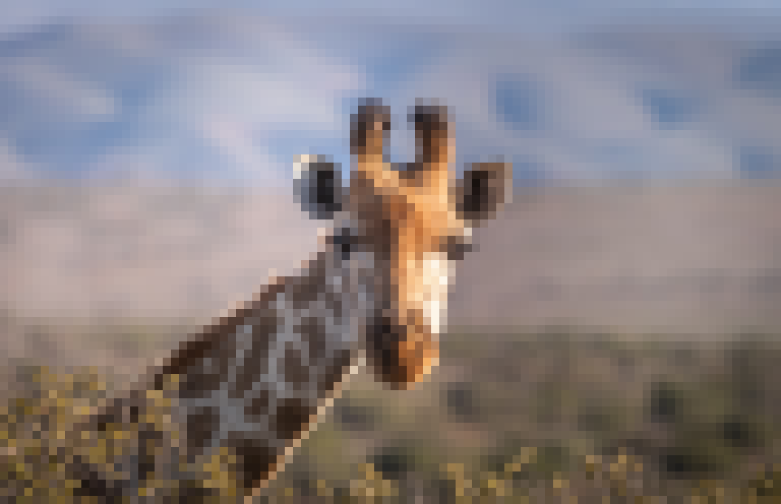
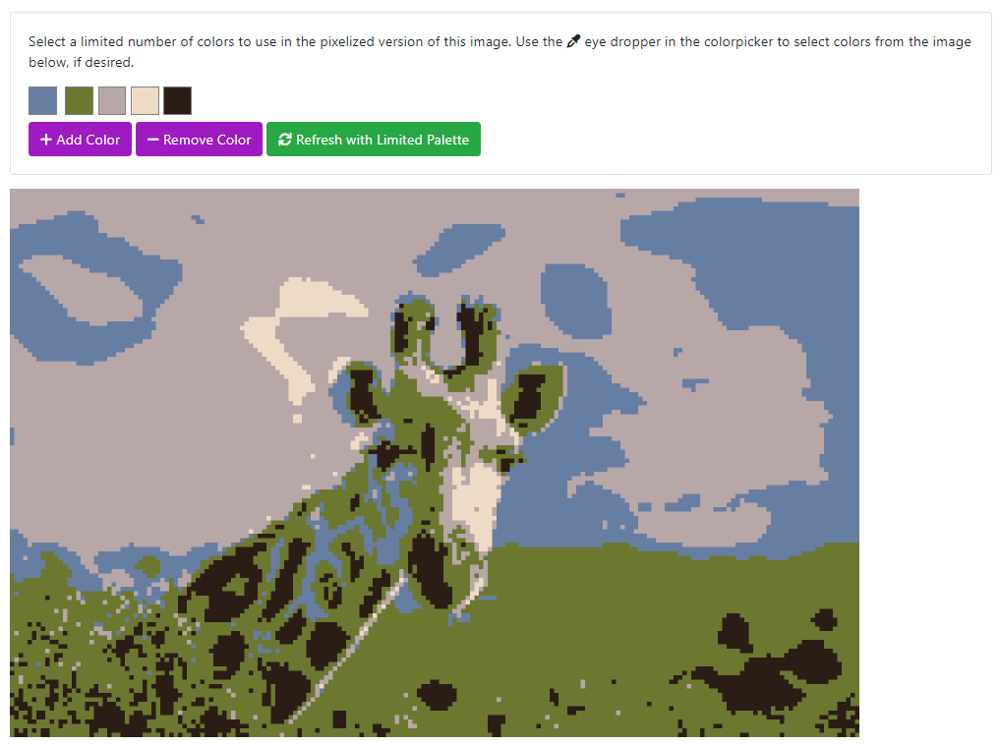

# pixit

An image pixelizer in the browser. Play with it at: https://lahuang4.github.io/pixit/

All client-side JavaScript. Upload an image to pixelize. Adjust the pixel size for more or less pixelization. Apply a limited palette of colors to the result for more artistic experimentation, if desired. Do final touch-ups with repainting.

Original:

Pixelized:

With a limited palette:

